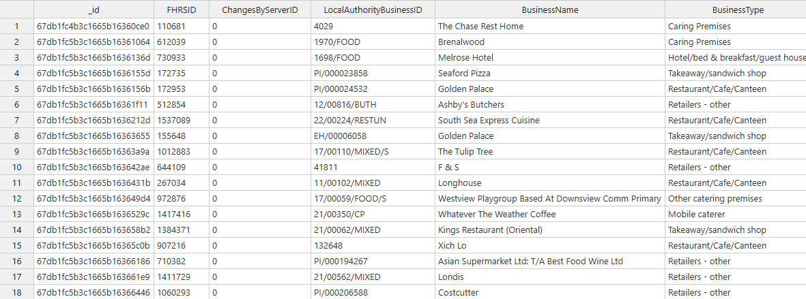
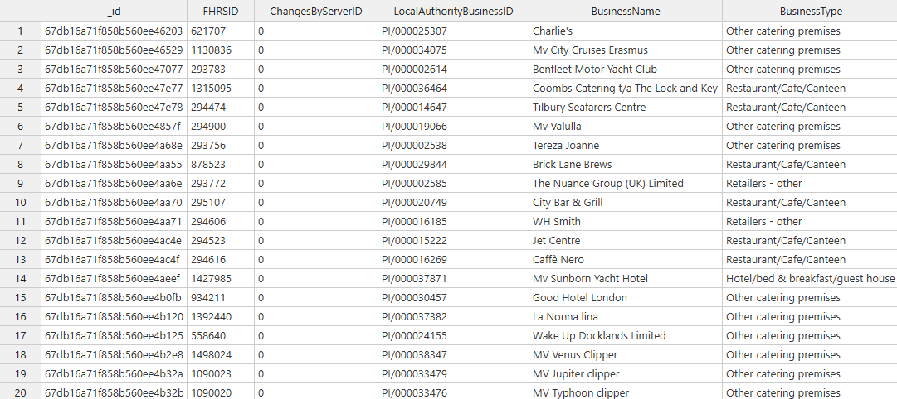
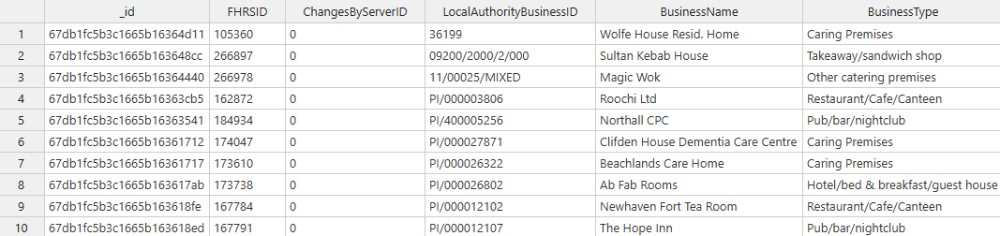
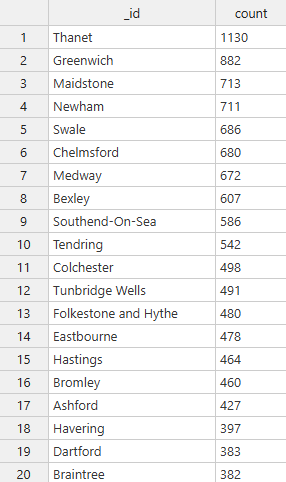

# nosql-challenge

This repo contains all solutions and work for the Module 12 NoSQL Challenge.

## Setup

Within `NoSQL_analysis_starter.ipynb` is all the work to set the database up (strings to numbers, etc.). Along with the minor details, every entry from the Local Authority of Dover was removed from the data set before analysis. 

## Analysis

Analysis was done on the database to find the following information, and a snippet of the resulting tables is included:

1. Which establishments have a hygiene score equal to 20?
    
    

2. Which establishments in London have a `RatingValue` greater than or equal to 4?
    
    

3. What are the top 5 establishments with a `RatingValue` of 5, sorted by lowest hygiene score, nearest to the new restaurant added, "Penang Flavours"?
    
    

4. How many establishments in each Local Authority area have a hygiene score of 0? Sort the results from highest to lowest, and print out the top ten local authority areas.

    
